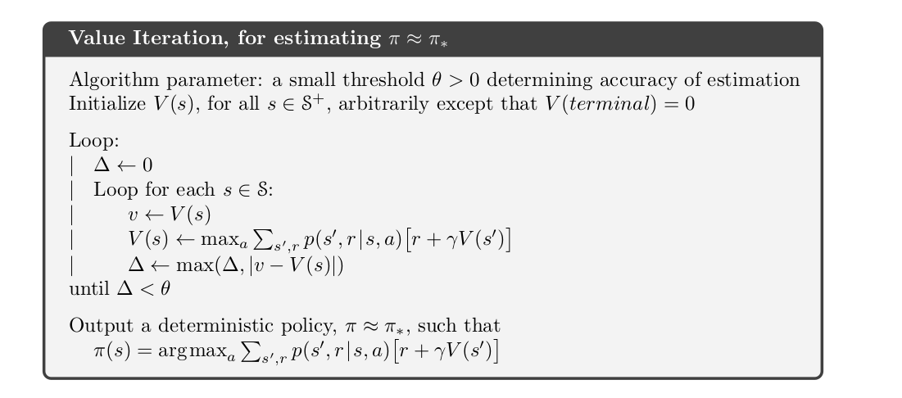

# FrozenLake8x8

## Solving the stochastic frozen lake problem using RL

#### Basic guide to Reinforcement Learning

The Frozen-Lake8x8 is an ice skating rink, divided into 64 cells (8x8), and some of the cells have broken the ice. The skater(Agent) begins to skate in the top-left position, and its goal is to reach the bottom-right place avoiding falling into the four holes in the track.

The environment(FrozenLake) has 64 states with each position denoting a state(0-63). The agent(skater) perfoms the action from the action-space as shown below:

```
{
    "Left": 0,
    "Down": 1,
    "Right": 2,
    "Up": 3
}
```

Now if the agent's action turn out to be as expected, the problem gets reduced to a simple path finding problem where we have to find an optimum path avoiding obstacles in the way. But it's not the case here..

To make it complicated, the ice rink turn out to be slippery. If for example, the agent tries to go to he left, there is a:

- 33% probability of slipping up
- 33% probability of slipping down
- 33% probability of going left

This can be found out from the code below:

```py
env = gym.make('FrozenLake8x8-v1',is_slippery=True)
env.reset()
print(env.env.P[0][0])
```

```
[
    (0.3333333333333333, 0, 0.0, False),
    (0.3333333333333333, 0, 0.0, False),
    (0.3333333333333333, 8, 0.0, False)
]
```

It gives the possible outcomes when state is 0 and action is 0 (i.e. Left) with theit probabilities. The boolean flag is set when the simulation ends and the floating value is the reward.

## Solution

For a particular state, first we calculate the state-action values for all the possible actions from that state, and then update the value function of that state with the greatest state-action value. The Value Iteration terminates when the difference between all the new State values and the old State Values is a negligibly small value. The pseudocode for value iteration and policy function is shown below:



The meaning of the terms are explained below:

- V(s): Value of state 's'
- S: Set of states
- Gamma: Discount factor. Used to reduce the reward when the goal is reached at a later point of time as compared to the current state.
- p: Probability function. p(s',r|s,a) = Probability of reaching state s' when current state is s and action taken is a and reward is r.
- pi: Policy function. pi(s) = policy at state s, i.e. action to be taken at state s for optimum result.
- Θ: Threshold value. If the difference between current state value and newly calculated state value is less than Θ, the loop terminates.

The code for value_iteration function and policy function is shown in the ipynb file.

The simulation was completed in a minimum of 16 steps and the average percentage of misses are = 25.78

> Thus the accuracy obtained was - 74.22%

The following plots were obtained:-


